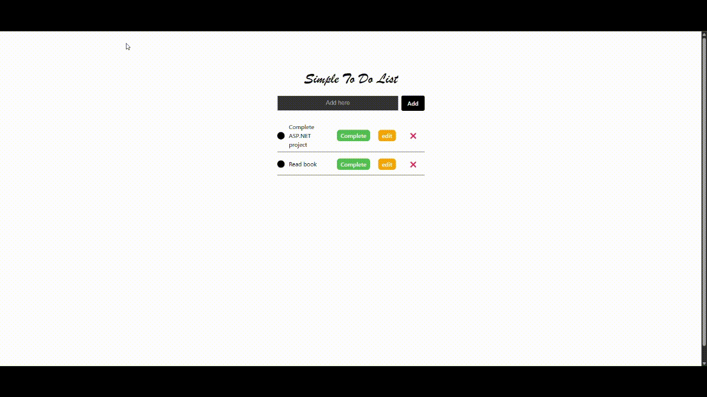

# **A Simple To Do App Using ASP.NET Web API and React**  

## **Overview ⚙️**  
This is a **ASP.NET Web API** and **React.js** project built for .NET developer role as part of their technical assessment. Details of the company and technical requirements will be kept hidden for privacy reasons.  

---

## **Getting Started 🚀**  

### **Prerequisites ✅**  
 
#### **Getting Started with Visual Studio**  
1. Download and install Visual Studio from [Visual Studio](https://visualstudio.microsoft.com/downloads/). 
2. Download ASP.NET from the installer to get started.
3. Follow the instructions on the installer to ensure successful installation.
4. Download the `ToDoAppV2` files to your folder.
5. Run the build.

#### **Getting Started with React**  
1. Download and install Visual Studio Code from [Visual Studio Code](https://visualstudio.microsoft.com/downloads/). 
2. Download Node.js from [Node.js](https://nodejs.org/en/download).
3. You can use NPM on your terminal to get started with React.
4. Download the `toDoList-client` files to your folder.
5. Run `npm install` to install modules.
6. Run `npm run dev` to start the page (please ensure the backend is running).

---

## Details + Demo Gif
Since this was a technical assessment and not a personal project, in-depth details is not provided in this README. This is intended for the Hiring Managers only. 

Various resources were used to complete this assessment, such as referring to documentation, open sources, and coding assistants. The code is written by me, and for the parts I needed clarification, I referred to the sources mentioned. This helped me to stay grounded and ensure proper code is written. This was also a learning process for me because C# and ASP.NET Core a still new concept to me but I find it interesting and hope to continue working on it. After a week of working on this assessment, here is the final product (only the UI is shown here and please wait a few seconds for the gif to play):

---

## **Future Improvements ✨**  
1. Add several to do lists functionality.
2. Add Authentication methods.
3. To do lists for multiple users. Sign in with email and password.
4. Use .gitignore files for push and pull.

---

## **References 📚**  
1. [ASP.NET](https://dotnet.microsoft.com/en-us/apps/aspnet/apis).
2. ChatGPT.
3. [Clean Architecture](https://medium.com/@mohanedzekry/clean-architecture-in-asp-net-core-web-api-d44e33893e1d).
---

## **Thank You! 😄**  
